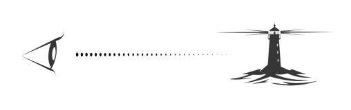
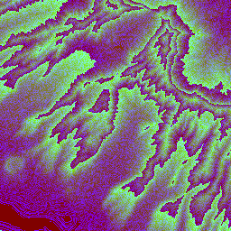
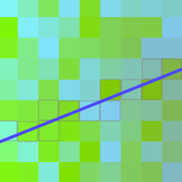
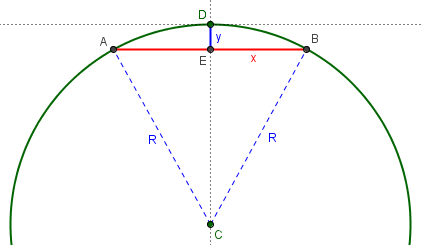

  <h1 align="center">Line of Sight</h1>

  

This project is a proof of concept for calculating whether or not there is line of sight between 2 points on the earth. While there are other tools to achieve this goal, this project aims to do so at lightning speed, while the origin and/or target are in motion.

<h1 align="center"><a href="https://slutske22.github.io/line-of-sight/" target="_blank">👀 View the Project 👀</a></h1>

## Methodology

Several factors contribute to whether or not there is direct line of sight between two points on the globe:

- Topography
- Structures and Buildings
- Earth's Curvature

## Topography / Elevation Profile

Global topography data is available in the form of RGB-encoded DEM via several sources. This PoC uses an [open dataset of bare-earth terrain tiles available via AWS S3](https://registry.opendata.aws/terrain-tiles/). A single tile contains elevation data encoded in RGB:

We can determine what `{x}/{y}/{z}` tiles lie along the line between 2 latlng points. Once downloaded, the exact `[x, y]` pixel positions along each tile is calculated using the [Bresenham algorithm](https://en.wikipedia.org/wiki/Bresenham%27s_line_algorithm). The RGB value of each pixel is extracted from the image:

Using the appropriate height function, we convert the RGB value into an elevation for each pixel, which creates a topographical elevation profile between the original 2 points.

Using methods similar to [leaflet-topography](https://github.com/slutske22/leaflet-topography#cacheing-tiles), each tile is kept in local memory in the form of an [ndarray](https://github.com/scijs/ndarray). With DEM data already in memory, subsequent line-of-sight calculations in the same area do not require additional api calls.

## Considering Earth's curvature

At large distances, the curvature of the earth may interfere with an otherwise direct line of sight. The height offset of $d$, along the _arc_ $\overset{\huge\frown}{AB}$ is represented by $y_r$ in this diagram:

The formula for this height $y_r$ as a function of the distance $d$ is:

$$ y_r = R \left( 1 - \dfrac{ \cos \left( \dfrac{\theta*{AB}}{2} \right) }{ \cos \left( \dfrac{\theta\_{AB}}{2} - \theta \right) } \right) $$

Where $\theta = \frac{d}{R}$. Ths discussion that spawned this formula can be found [here](https://math.stackexchange.com/questions/4653429/height-of-circle-bulge-along-given-arc/4653616). In scenarios where earth's curvature is calculated, every pixel at a distance $d$ the line between two points includes the term $y_r(d)$.

---

This project was bootstrapped with [Create React App](https://github.com/facebook/create-react-app).
