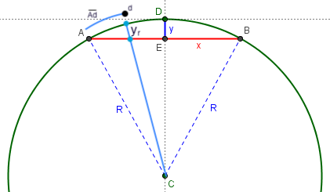

# Line of Sight

This project is a proof of concept for calculating whether or not there is line of sight between 2 points on the earth. While there are other tools to achieve this goal, this project aims to do so at lightning speed, while the origin and/or target are in motion.

## Considering Earth's curvature

At large distances, the curvature of the earth may interfere with an otherwise direct line of sight.

To find the vertical bulge of the earch between 2 points, we can use the [following formula](https://www.themathdoctors.org/how-much-does-the-earth-curve/):

$$ -y = R + \frac{\sqrt{4R^2 - L^2}}{2} $$

Where $L$ is the distance between $A$ and $B$. If $L$ is small compared to $R$, the following approximation works as well:

$$ y = -L^2 / 8R $$

This math assumes you know the direct distance $L$. But in the case of measuring distances on earth, we often don't know the direct distance (the _chord_), but rather the distance along the curvature of the earth's surface, which is arc $\overline{AB}$. The chord length can be derived from the arc length with [this formula](https://www.vcalc.com/wiki/chord-length-from-arc-length-and-radius):

$$ L = 2R \cdot sin(\frac{\overline{AB}}{2R}) $$

In order to find the height of the earth's bulge at every pixel along a line between 2 points, we would have to call the `Math.sin` function as many times as there are pixels. Considering `Math.sin` is very [computationally demanding](https://stackoverflow.com/questions/2479517/is-trigonometry-computationally-expensive), it may be useful in the code to use a [sin approximation function](https://datagenetics.com/blog/july12019/index.html) instead.

---

This project was bootstrapped with [Create React App](https://github.com/facebook/create-react-app).
